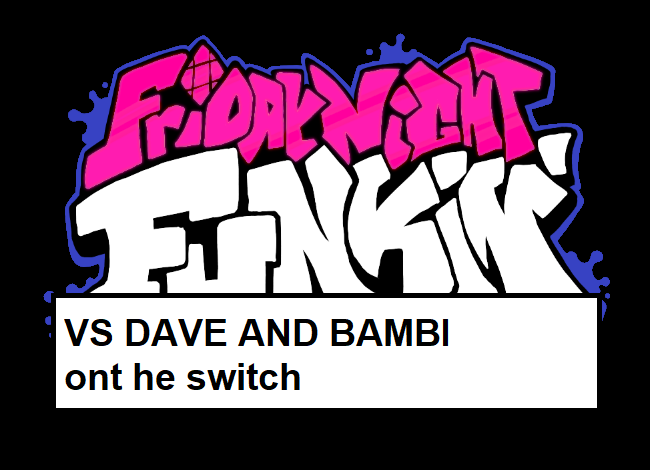

# HUGE THANKS TO [HTV04](https://www.github.com/HTV04) FOR MAKING [FUNKIN-REWRITTEN!](https://github.com/HTV04/funkin-rewritten) btw if you are readint this you have my permission to take anything you wantfrom this to there :)

# 
    

VVVV some of this stuff is not relevent lol
# Special Thanks
* KadeDev for [FNFDataAPI](https://github.com/KadeDev/FNFDataAPI), which was refrenced while developing the chart-reading system
* The developers of [BeatFever Mania](https://github.com/Sulunia/beatfever) for their music time interpolation code
* The developers of the [LÖVE](https://love2d.org/) framework, for making Funkin' Rewritten possible
* p-sam for developing [love-nx](https://github.com/retronx-team/love-nx), used for the Nintendo Switch version of the game
* Davidobot for developing [love.js](https://github.com/Davidobot/love.js), used for the Web version of the game
* TurtleP for developing [LÖVE Potion](https://github.com/lovebrew/LovePotion), originally used for the Nintendo Switch version of the game
* Funkin' Crew (ninjamuffin99, PhantomArcade, kawaisprite, and evilsk8er), for making such an awesome game!

to 'press 7' hold down all the triggers and press minus
to exit the game at any time, hold down minus and plus

hi

TODOS:
- fix any bugs that come in

KNOWN ISSUES:
- audio gets all messed up if you put the switch into sleep mode and turn it back on?? what the hell